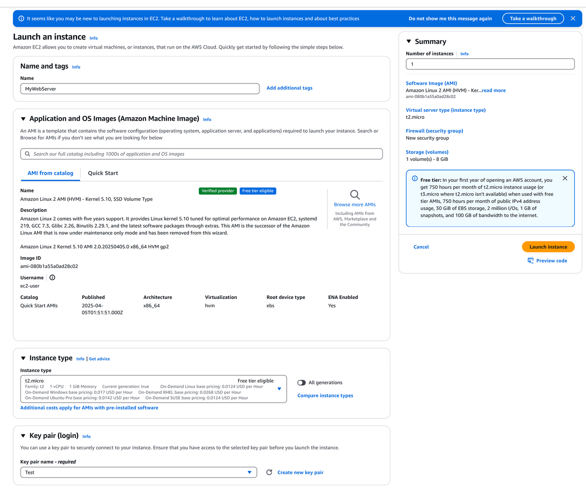
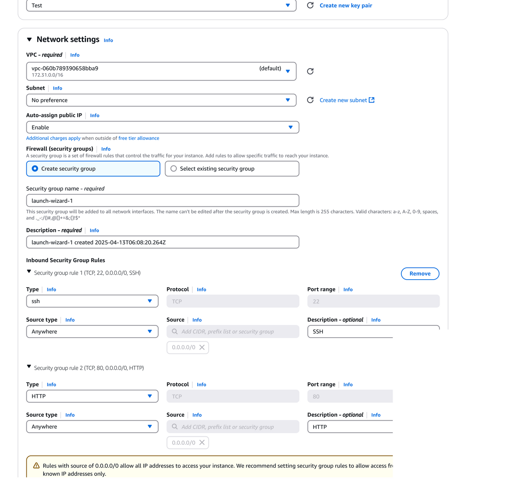
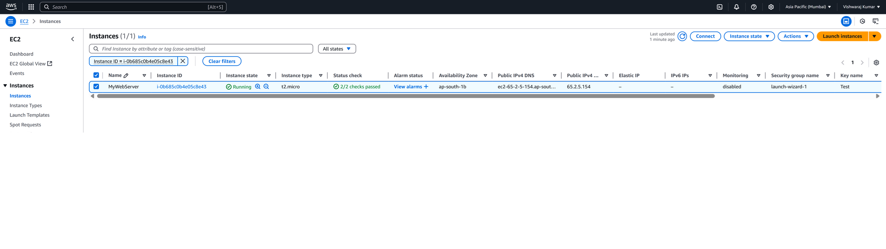
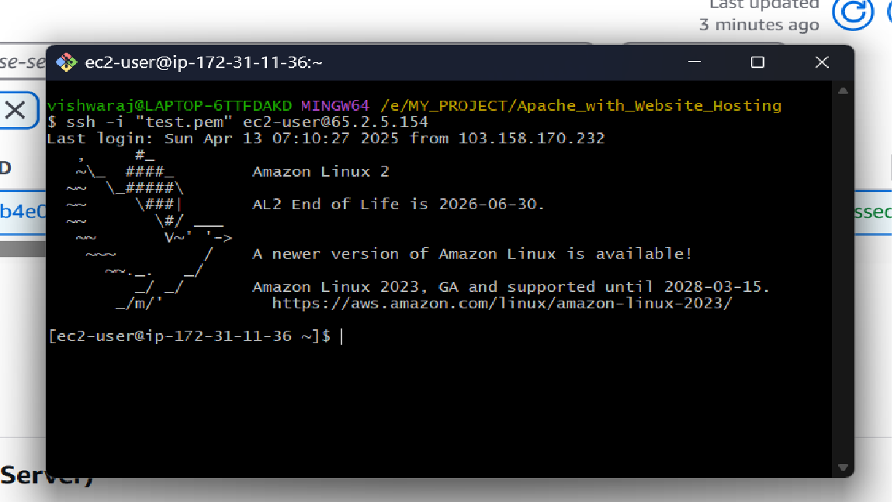
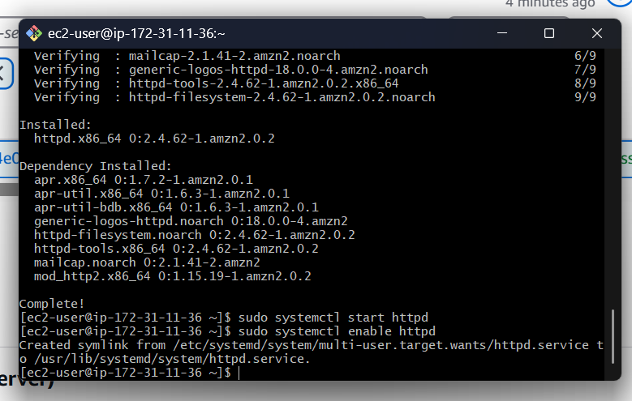
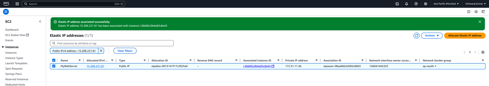
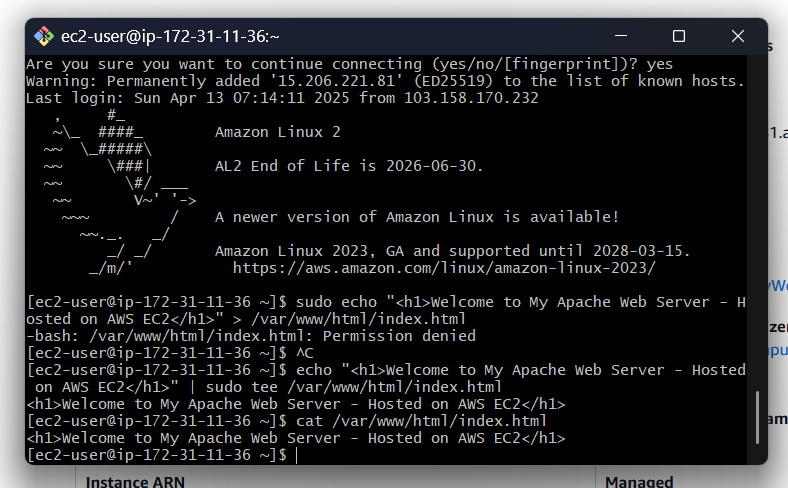
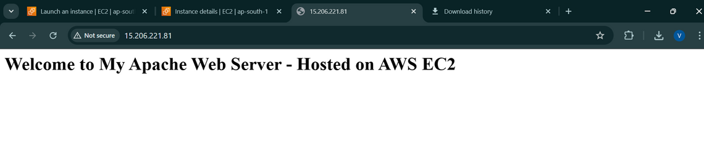
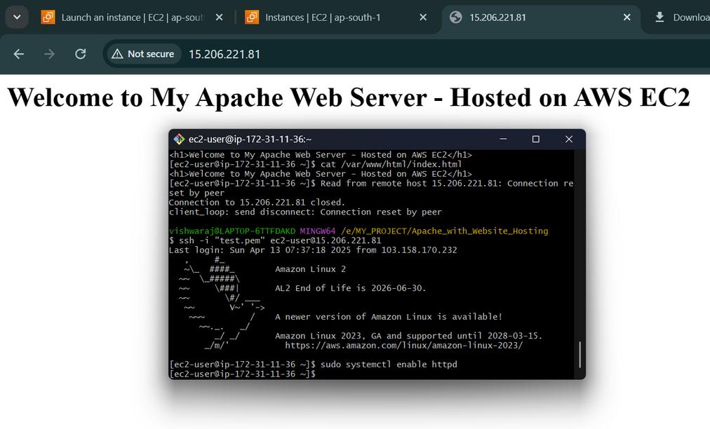

# EC2 Web Server Deployment (Apache + Website Hosting)

## 📌 Introduction
In this project, I created and deployed a web server using the AWS EC2 service. I used an Amazon Linux 2 instance, installed the Apache web server on it, and hosted a simple HTML page. I also attached an Elastic IP to keep the server's IP address fixed. Through this project, I learned how to launch and manage virtual machines on AWS and host websites on the cloud.

---

## ⚙️ Step-by-Step Process

### ▶ Step 1: Launching EC2 Instance
First, I logged in to my AWS Management Console and went to the
**EC2 service** from the Services menu. From the EC2 Dashboard, I clicked on
"**Launch Instance**" to start creating a virtual machine.

In the "Launch Instance" form:

- I entered the **name** of the instance as MyWebServer.
- I chose the **Amazon Machine Image (AMI)** as **Amazon Linux 2 (Free tier eligible)**.
- For **instance type** , I selected **t2.micro**, which is free-tier eligible and perfect for small projects.
- Then, I created a **new key pair** and downloaded the .pem fi le to my system, which I would later use to connect via SSH.

<p align="center">
  
  </p>


### ▶ Step 2: Configuring Security Group
In the same launch wizard, I created a new **Security Group** with these inbound rules:

- **SSH (port 22)** – so I can connect to the server from my system.
- **HTTP (port 80)** – so my website can be accessed through the browser.

For both ports, I allowed access from **Anywhere (0.0.0.0/0)** for testing purposes.

<p align="center">
  
  <br>
  <em>Figure: Network settings in instance</em>
</p>

<p align="center">
  
  <br>
  <em>Figure: Instance running status</em>
</p>

### ▶ Step 3: Connecting to EC2 via SSH
Once the instance was running, I copied its **public IPv4 address** and opened my terminal. I navigated to the folder where my .pem fi le was saved, then ran this command to connect:

```bash
ssh -i "Your_pem_file_name.pem" ec2-user@<EC2_PUBLIC_IP>
```

<p align="center">
  
  <br>
  <em>Figure: Bash terminal use to connect EC2 via SSH</em>
  </p>

### ▶ Step 4: Installing Apache Web Server
After connecting to the EC2 instance, I ran these commands one by one:

```bash
sudo yum update -y
sudo yum install httpd -y
sudo systemctl start httpd
sudo systemctl enable httpd
```
- The fi rst command updates the system.
- The second one installs Apache web server.
- The last two start Apache and make sure it starts automatically every time the server boots.

<p align="center">
  
</p>

### ▶ Step 5: Assigning an Elastic IP
To keep my server’s IP address the same even after rebooting, I attached an **Elastic IP**:

- From the EC2 Dashboard, I clicked on **Elastic IPs** in the left menu.
- I clicked "**Allocate Elastic IP**" , then chose default settings and clicked "Allocate".
- Then I clicked "**Associate Elastic IP**" and selected my EC2 instance from the list.

Now, this Elastic IP was permanently linked to my server.

<p align="center">
  
  <br>
  <em>Figure: Elastic IP was permanently linked</em>
</p>

### ▶ Step 6: Hosting a Sample Website
I created a simple HTML page using the following command:

```bash
echo "<h1>Welcome to My Apache Web Server - Hosted on AWS EC2</h1>" | sudo tee /var/www/html/index.html
```

Checked the content:

```bash
cat /var/www/html/index.html
```

<p align="center">
  
</p>

Then, I opened my browser and typed my Elastic IP in the address bar. The page loaded and showed my custom message. That conforrmed my web server was working! ( http://15.206.221.81 ).

<p align="center">
  
  <br>
  <em>Figure: Web server working in browser</em>
</p>

Access the website at: `http://<Elastic_IP>`

### ▶ Step 7: Auto-start Apache on Reboot
To ensure Apache runs even if I reboot the server, I used this command again (just to be safe):

```bash
sudo systemctl enable httpd
```

This command makes sure that Apache starts automatically every time the instance is restarted.

<p align="center">
  
  <br>
  <em>Figure: Bash terminal run enable httpd command</em>
</p>

---

## ✅ What I Learned
- How to launch and configure an EC2 instance
- How to set up security groups for access
- How to connect to a cloud server using SSH
- How to install and run a web server
- How to keep a fi xed IP using Elastic IP 
- How to host and view a website on the cloud

This project gave me confi dence to work with cloud servers and host real websites on AWS. It was a great learning experience for me as a beginner in cloud computing.

---

## ✍️ Author

**Vishwaraj Kumar**  
🔗 [GitHub Profile](https://github.com/vishwaraj-kumar)  
🔗 [LinkedIn Profile](https://www.linkedin.com/in/vishwaraj-kumar/)
